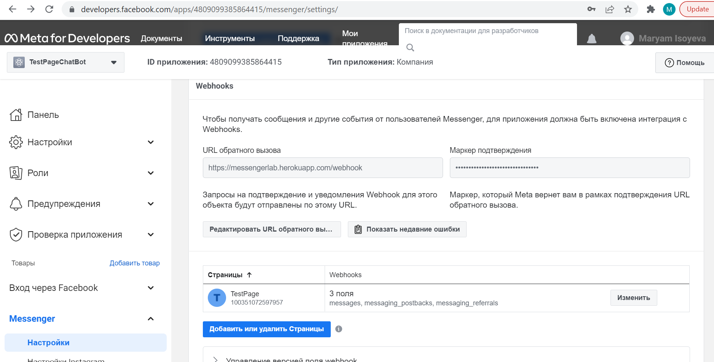
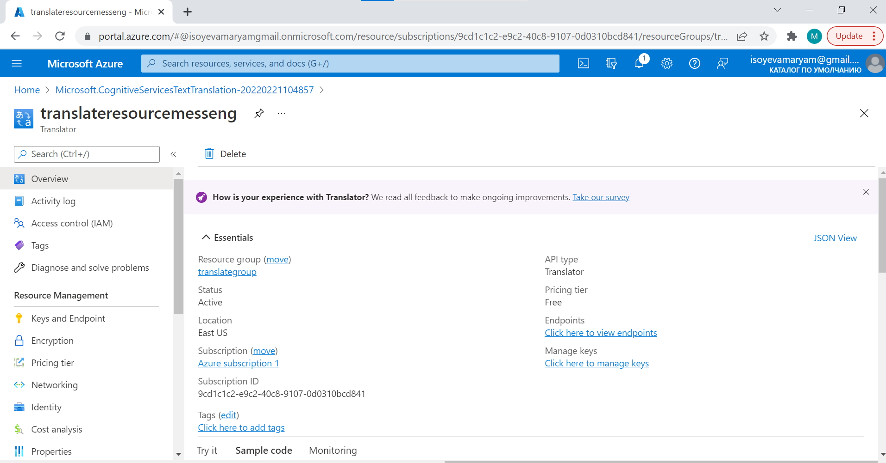
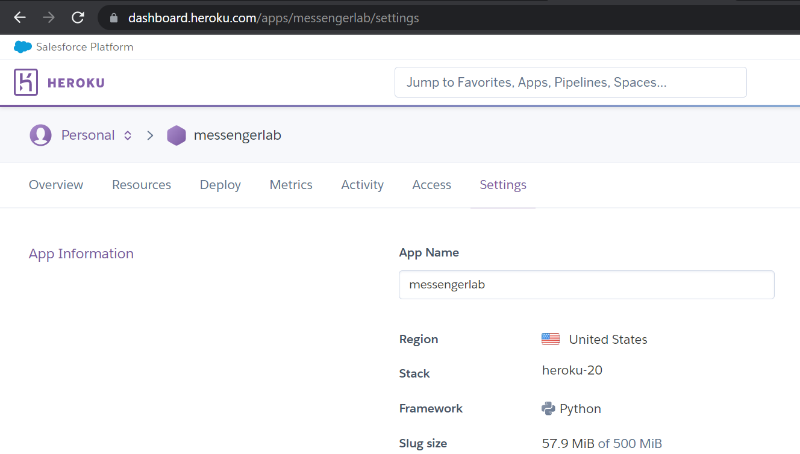
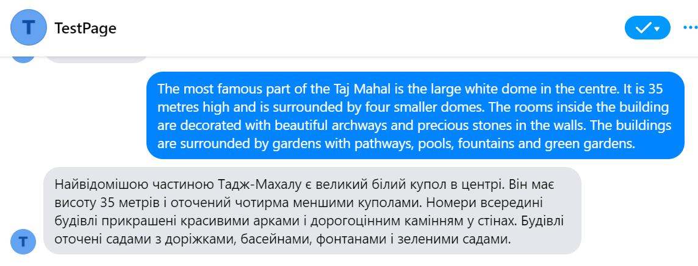
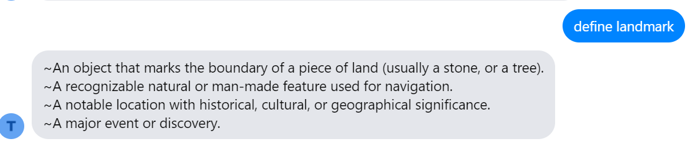

#Messenger bot

Бот для перекладу тексту українською та отримання визначень слів
Використано мову Python, Microsoft Azure Text Translation Service, відкрите API словника англійської мови, сервіси Meta for developers

###Кроки

1) Створено тестову сторінку на Facebook, налаштовано доступ додатку, згенеровано ключі, налаштовано відповідний webhook

2) Налаштовано акаунт Microsoft Azure, додано сервіс перекладу

3) Розроблено бот з використанням Flask, налаштовано Heroku акаунт, виконано deploy бота

Якщо боту надіслати текст англійською мовою, то у відповідь прийде переклад цього тексту українською

Можна також надіслати повідомлення "define <word>", тоді у відповідь надійде визначення даного слова англійською

*Скрінкаст є у даному репозиторії, файл "Screencast.mp4"